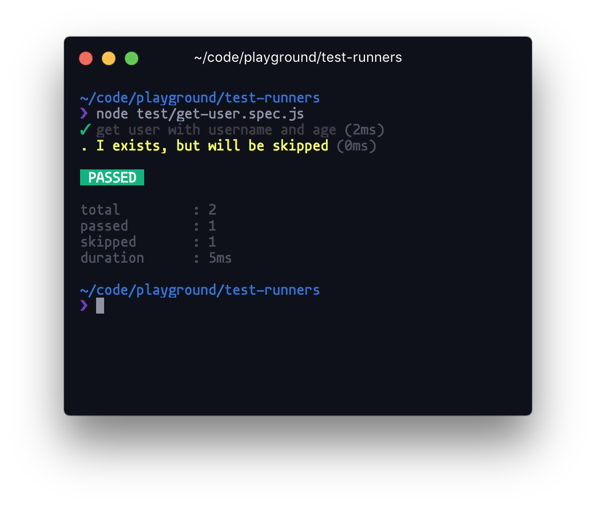
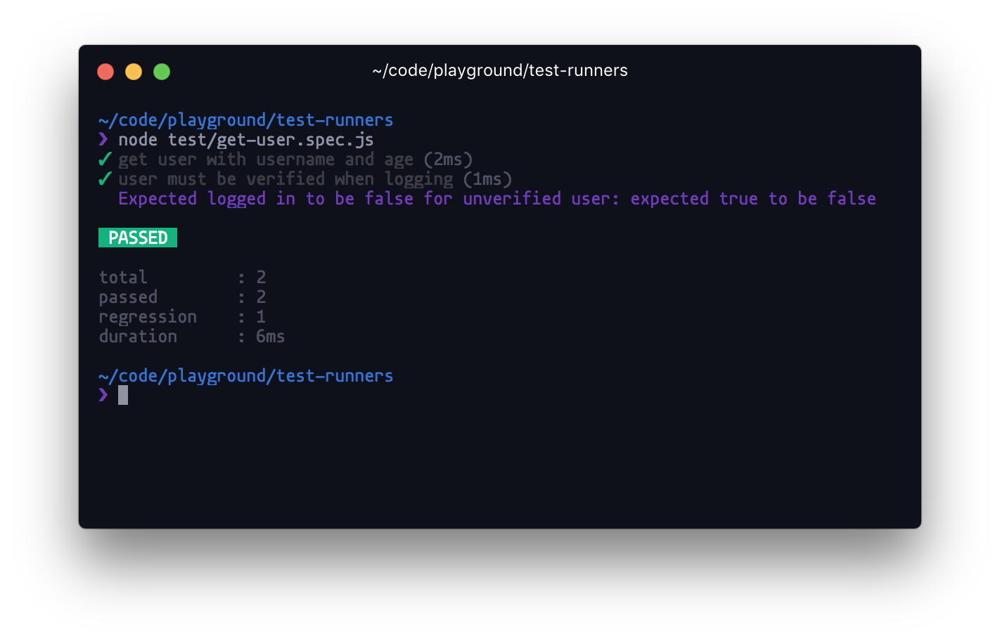
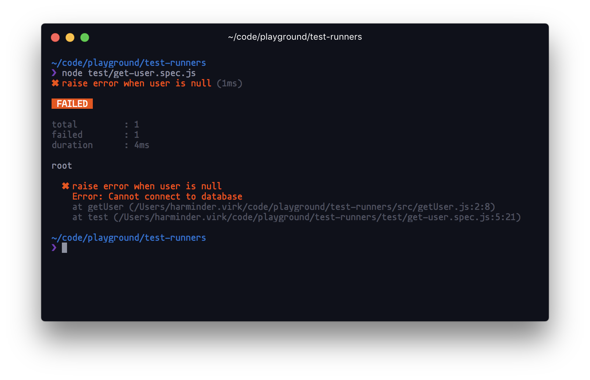
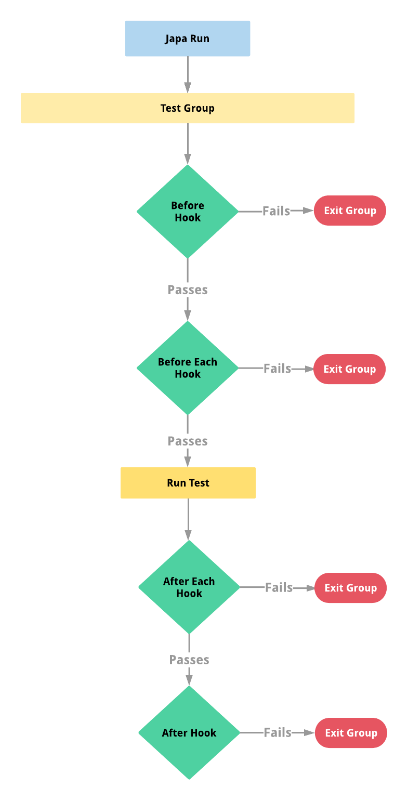

# Japa
> A test runner to create test runners

Japa is a tiny **Node.js** test runner that you can use to [**test your apps**]() or even [**create your test runner**](https://github.com/thetutlage/japa/wiki/Create-your-test-runner-using-Japa).

Japa is **simple**, **fast** and has **minimal core**. Japa doesn't ship with any CLI. You run your test files as standard Node.js scripts.

```js
node test/list-users.spec.js
```

<!-- START doctoc generated TOC please keep comment here to allow auto update -->
<!-- DON'T EDIT THIS SECTION, INSTEAD RE-RUN doctoc TO UPDATE -->
## Table of contents

- [Features](#features)
- [Why Japa?](#why-japa)
  - [Faster boot time ⏰](#faster-boot-time-)
  - [Simpler Syntax 💅](#simpler-syntax-)
- [Test your apps](#test-your-apps)
  - [Installation](#installation)
  - [Writing your first test](#writing-your-first-test)
  - [async/await](#asyncawait)
  - [Test timeouts](#test-timeouts)
  - [Test groups](#test-groups)
  - [Skipping tests](#skipping-tests)
  - [Skipping/Running tests in CI](#skippingrunning-tests-in-ci)
  - [Run selected tests](#run-selected-tests)
  - [Retry flaky tests](#retry-flaky-tests)
  - [Regression tests](#regression-tests)
  - [Assertion Planning](#assertion-planning)
  - [Cleaner Error Stack](#cleaner-error-stack)
- [Runner hooks](#runner-hooks)
- [Japa flow](#japa-flow)
- [Running multiple test files](#running-multiple-test-files)
  - [Filtering files](#filtering-files)
- [Configure options](#configure-options)
- [Running typescript tests](#running-typescript-tests)

<!-- END doctoc generated TOC please keep comment here to allow auto update -->

<br>

---

## Features

- Supports [ES6 async/await](#asyncawait) style tests.
- Doesn't pollute the global namespace.
- First class support for [regression](#regression-tests) tests.
- Conditionally [skip](#skipping-tests) when running tests in CI like **travis**.
- [Retry flaky tests](#retry-flaky-tests).
- Define [test timeout](#test-timeouts).
- Cleaner [error stack](#cleaner-error-stack).
- [Test groups](#test-groups) with lifecycle hooks.
- Inbuilt assertion library with [assertion planning](#assertion-planning).

<br>

---

## Why Japa?

The primary reason to use Japa is that you can [**create your test runner**](https://github.com/thetutlage/japa/wiki/Create-your-test-runner-using-Japa) using it. Which is impossible or cumbersome with other test runners like Ava or Mocha.

However, Japa also shines as a standalone test runner.

<br>

---


###  Faster boot time ⏰
Since Japa core is minimal doesn't have any CLI to run tests, it boots faster than Mocha and Ava.

> The following benchmark is not a comparison to look down at Mocha or Ava, they are great test runners and offers a lot more than Japa.


1. First is mocha **( 0.20 seconds )**
2. Seconds is Ava **( 0.73 seconds )**
3. Third is Japa **( 0.12 seconds )**


<br>

---


### Simpler Syntax 💅

The Japa syntax is very similar to Ava. Additionally, it allows grouping tests using the `group` method.

```js
const test = require('japa')

test('list users', () => {
})
```

Group tests

```js
const test = require('japa')

test.group('User', (group) => {
  group.beforeEach(() => {
  })
  
  test('list users', () => {
  
  })
})
```

## Test your apps

This section covers the topics to write tests for your apps using Japa. If you are looking to create a test runner, then read the [**custom test runner guides**]().

<br>

---

### Installation

The installation is like any other Node.js package.

```shell
npm i --save-dev japa

# yarn
yarn add --dev japa
```

<br>

---


### Writing your first test

Let's start by writing the first test for a method that returns the user object. 

**src/getUser.js**

```js
module.exports = function getUser () {
  return {
    username: 'virk',
    age: 28
  }
}
```

**test/get-user.spec.js**

```js
const test = require('japa')
const getUser = require('../src/getUser')

test('get user with username and age', (assert) => {
  assert.deepEqual(getUser(), {
    username: 'virk',
    age: 28
  })
})
```

Now run the test file as follows.

```shell
node test/get-user.spec.js
```


That's all there to learn! See you tomorrow 😝. Okay wait, let's explore all the features of Japa.

<br>

---

### async/await
Async/await one of the best ways to write async code, without spending your entire day in opening and closing curly braces.

Japa has out of the box support for them.

```js
test('get user', async () => {
  const user = await Db.getUser()
})
```

Also, you can return Promises from your tests and Japa will resolve them for you. If the promise rejects, the test will be marked as failed.

```js
test('get user', () => {
  return Db.getUser()
})
```

<br>

---

### Test timeouts

Your tests must always timeout, otherwise you may end up with a never-ending process if one of your tests gets stuck.

Japa adds a timeout of `2000 milliseconds` by default to all of your tests, which is a reasonable time. However, tests which interact with a **Browser** or **3rd party API** may need a larger timeout.

**Passing 0 as the timeout will disable the timeout**

```js
test('query contributors from github', async () => {
  await gh.getContributors()
}).timeout(6000)
```

<br>

---

### Test groups

Grouping tests are helpful when you want to perform actions `before,` `after` the group or `beforeEach` or `afterEach` test.

```js
const test = require('japa')

test.group('Group name', (group) => {

  group.before(async () => {
  })

  group.beforeEach(async () => {
  })  

  group.after(async () => {
  })  

  group.afterEach(async () => {
  })  
  
})
```

- The `before` hook is executed only once before all the tests.
- The `after` hook is executed only once after all the tests.
- The `beforeEach` hook is executed before every test.
- The `afterEach` hook is executed after every test.

<br>

---

### Skipping tests

When refactoring code bases, you may break a bunch of existing functionality causing existing tests to fail.

Instead of removing those tests, it's better to skip them and once your codebase gets stable, re-run them to make sure everything is working fine.

```js
test.skip('I exists, but will be skipped', () => {

})
```

The default `list` reporter will show skipped tests in yellow.



<br>

---

### Skipping/Running tests in CI

Some projects are highly dependent on the execution environment. For example, A test of yours depends on an `API_KEY` which cannot be shared with everyone in the company. In this case, you can save the key with a CI like Travis and only run dependent tests in CI and not on local machine.

Japa supports this behavior as a first class citizen using `runInCI` method.

```js
test.runInCI('I will execute in CI only', () => {
})
```

The opposite of same is also available.

```js
test.skipInCI('I will be skipped in CI', () => {
})
```

<br>

---

### Run selected tests
Just like skipping tests, you can also run a specific test using `test.only` method.

- If multiple tests uses `test.only`, then only the last one will be entertained.

```js
test.only('all other tests will be skipped, except me', () => {
})
```

<br>

---

### Retry flaky tests

Flaky tests are those, which needs a couple of retries before they can pass. Japa exposes a helpful method to retry the same test (until it passes) before marking it as failed.

**Following will be executed four times in total. `3 retries + 1 actual`.**

```js
test('I am flaky attimes', () => {

}).retry(3)
```

<br>

---


### Regression tests

The best way to accept code contributions is to ask people to write failing tests for the bugs. Later, you fix that bug and keep the test in its place.

When creating a regression that, you are telling `japa`, **I want this test to fail** and when it fails, Japa marks it passed to keep the whole tests suite green.

```js
test.failing('user must be verified when logging', async (assert) => {
  const user = await Db.getUser()
  user.verified = false
  
  const loggedIn = await auth.login(user)
  assert.isFalse(loggedIn, 'Expected logged in to be false for unverified user')
})
```

Now if `login` returns true, Japa will mark this test as passed and will print the assertion note.



When you fix this behavior, remove `.failing` and everything should be green.

<br>

---


### Assertion Planning

Have you ever wrote one of those `try/catch` tests, in which you want the test to throw an exception?

```js
test('raise error when user is null', async (assert) => {
  try {
    await auth.login(null)
  } catch ({ message }) {
    assert.equal(message, 'Please provide a user')
  }
})
```

Now, what if `auth.login` never throws an exception? The test will still be green since the `catch` block was never executed. 

This is one of those things, which even bites seasoned programmers. To prevent this behavior, Japa asks you to plan assertions.

```js
test('raise error when user is null', async (assert) => {
  assert.plan(1)

  try {
    await auth.login(null)
  } catch ({ message }) {
    assert.equal(message, 'Please provide a user')
  }
})
``` 

Now, if `catch` block is never executed, Japa will complain that you planned for `1` assertion, but never ran any.


<br>

---


### Cleaner Error Stack

The default `list` reporter, will clean the stack traces by removing Japa core from it. It helps you in tracing the errors quickly.



<br>

---

## Runner hooks
Runner hooks are executed before and after running the entire test suite. These hooks can be used to perform global actions, which are required for all test groups.

The `before` and `after` hooks can be defined inside the configure object.

```js
const { configure } = require('japa')

configure({
  before: [
    async (runner) => {
      // setup db
    }
  ],
  after: [
    async (runner) => {
      // cleanup db
    }  
  ]
})
```

<br>

---

## Japa flow

Japa will attempt to run as many tests as possible when tests or group hooks start failing. 

- If one of the group **fails**, it will not impact the other groups.
- If one of the test **fails**, it will not affect other tests.

However, if `lifecycle hooks` will fail, they will exit early and will mark the entire group as failed. This behavior is done intentionally since if `beforeEach` hook is failing, then tests will get unstable, and there is no point in running them.

Check out the following flowchart to understand it better.



<br>

---

## Running multiple test files
Sooner or later, you will have multiple tests files, that you would like to run together, instead of running one file at a time. Doing same is very simple and is achieved using a **master test file**.

Let's create a master test file called `japaFile.js` in the project root and write following code inside it.

```js
const { configure } = require('japa')
configure({
  files: ['test/*.spec.js']
})
```

Now execute the file using the node command `node japaFile.js`.

### Filtering files
Not only you can define the glob, you can also filter the test files.

```js
const { configure } = require('japa')

configure({
  filter (filePath) {
    // return true for file(s) that you want to load
  },
  files: ['test/*.spec.js']
})
```

Also, you can define files to ignore with the `files` property. The files property is 100% compatible with [fast-glob](https://www.npmjs.com/package/fast-glob).

```js
const { configure } = require('japa')
configure({
  files: ['test/*.spec.js', '!test/users.spec.js']
})
```

<br>

---

## Configure options
Here's the list of the options the `configure` method accepts.

<table>
<tr>
  <td colspan="2"><code>{</code></td>
</tr>
<tr>
  <td valign="top"><code>timeout:</code></td>
  <td>
    <p>The global timeout for all the tests. However, you can override this value by defining explicit timeout of the group of the test.</p>
  </td>
</tr>
<tr>
  <td valign="top"><code>bail:</code></td>
  <td>
    <p>If value of <code>bail = true</code>, then the first failing test will exit the process.</p>
  </td>
</tr>
<tr>
  <td valign="top"><code>grep:</code></td>
  <td>
    <p>Define a string or regex to match the test titles and only run matching tests.</p>
  </td>
</tr>
<tr>
  <td valign="top"><code>files:</code></td>
  <td>
    <p>An array glob patterns to load test files from.</p>
  </td>
</tr>
<tr>
  <td valign="top"><code>filter:</code></td>
  <td>
    <p>A custom callback to dynamically filter tests.</p>
  </td>
</tr>
<tr>
  <td valign="top"><code>before:</code></td>
  <td>
    <p>An array of hooks to be executed before running all the tests. <strong>Hooks are executed in sequence</strong></p>
  </td>
</tr>
<tr>
  <td valign="top"><code>after
  :</code></td>
  <td>
    <p>An array of hooks to be executed after running all the tests. <strong>Hooks are executed in sequence</strong></p>
  </td>
</tr>
<tr>
  <td colspan="2"><code>}</code></td>
</tr>
</table>

<br>

---

## Running typescript tests
Running test files written in `Typescript` is a piece of cake for Japa. Since everything is done inside the Javascript files, we can ask `japaFile.js` to load `ts-node`.

```js
// Load ts-node
require('ts-node').register()

const { configure } = require('japa')
configure({
  files: ['test/*.ts']
})
```
